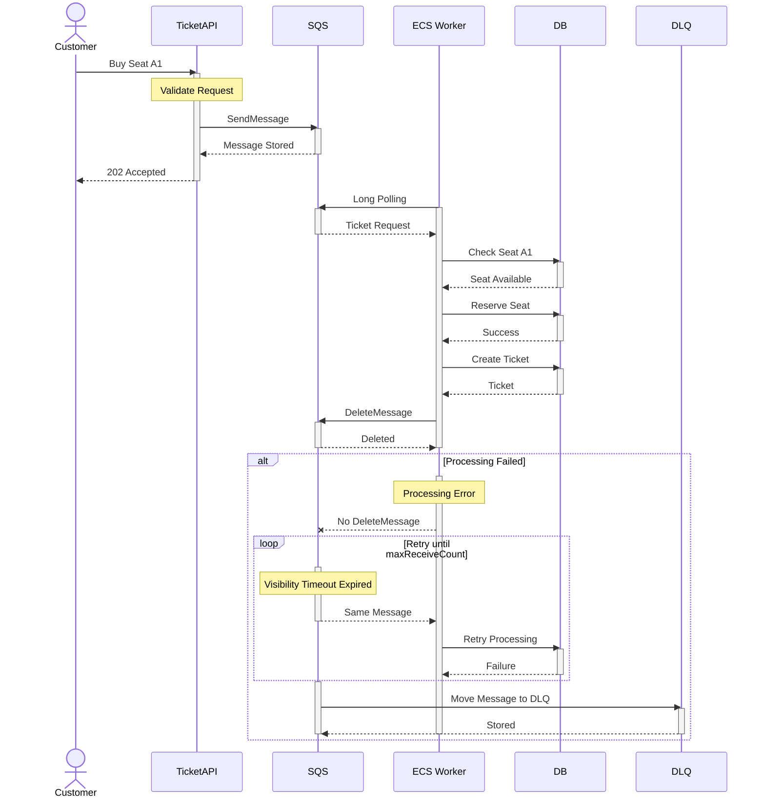

```mermaid
sequenceDiagram
    actor Customer
    participant TicketAPI
    participant SQS
    participant ECSWorker as ECS Worker
    participant DB
    participant DLQ

    Customer->>TicketAPI: Buy Seat A1
    activate TicketAPI

    Note over TicketAPI: Validate Request

    TicketAPI->>SQS: SendMessage
    activate SQS
    SQS-->>TicketAPI: Message Stored
    deactivate SQS

    TicketAPI-->>Customer: 202 Accepted
    deactivate TicketAPI

    ECSWorker->>SQS: Long Polling
    activate ECSWorker
    activate SQS
    SQS-->>ECSWorker: Ticket Request
    deactivate SQS

    ECSWorker->>DB: Check Seat A1
    activate DB
    DB-->>ECSWorker: Seat Available
    deactivate DB

    ECSWorker->>DB: Reserve Seat
    activate DB
    DB-->>ECSWorker: Success
    deactivate DB

    ECSWorker->>DB: Create Ticket
    activate DB
    DB-->>ECSWorker: Ticket #12345
    deactivate DB

    ECSWorker->>SQS: DeleteMessage
    activate SQS
    SQS-->>ECSWorker: Deleted
    deactivate SQS

    deactivate ECSWorker

    alt Processing Failed

        activate ECSWorker

        Note over ECSWorker: Processing Error
        ECSWorker--xSQS: No DeleteMessage

        loop Retry until maxReceiveCount

            activate SQS
            Note over SQS: Visibility Timeout Expired
            SQS-->>ECSWorker: Same Message
            deactivate SQS

            ECSWorker->>DB: Retry Processing
            activate DB
            DB-->>ECSWorker: Failure
            deactivate DB

        end

        activate SQS
        SQS->>DLQ: Move Message to DLQ
        activate DLQ
        DLQ-->>SQS: Stored
        deactivate DLQ
        deactivate SQS

        deactivate ECSWorker

    end
```
